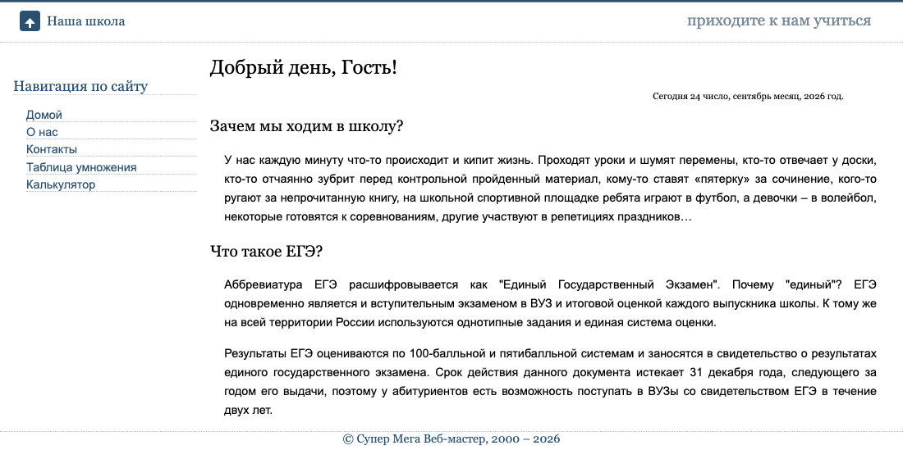
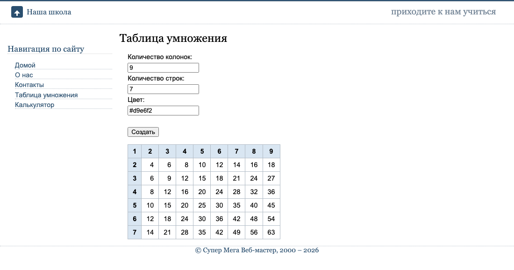
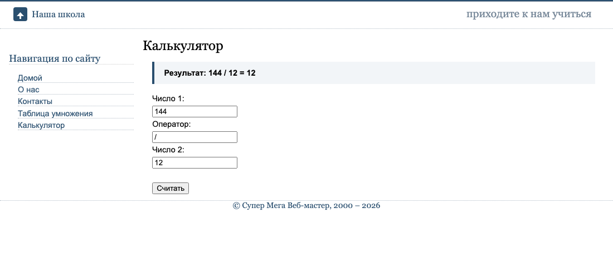
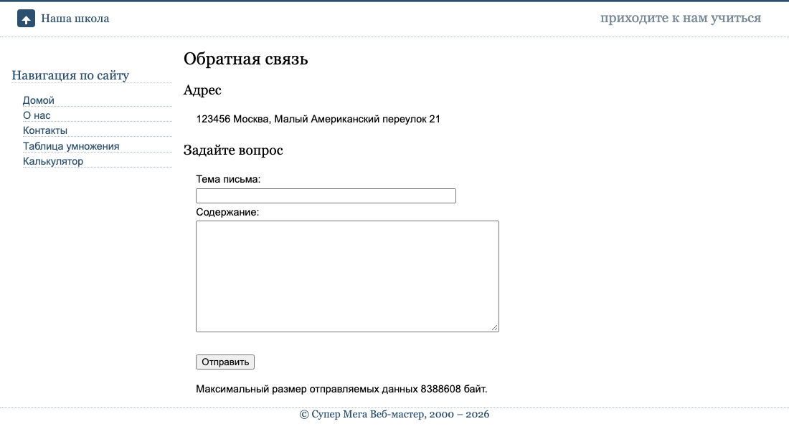
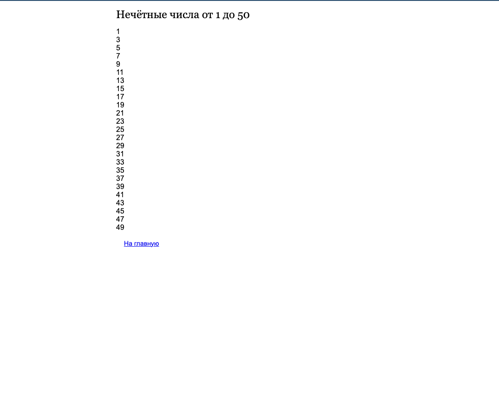
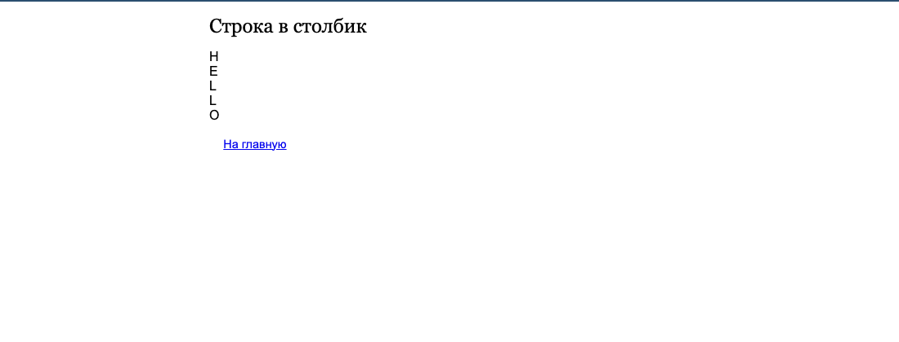
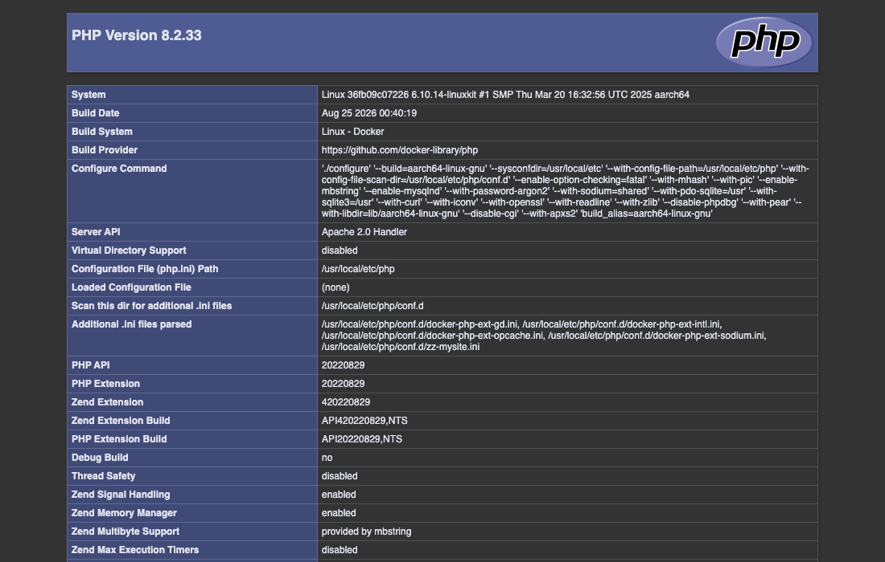

# Отчёт по практической работе № 2

**Тема:** Знакомство с PHP
**Дисциплина:** Веб-программирование
**Выполнил(а):** Ситникова Екатерина Георгиевна, группа ПИ1у/24б
**Дата:** 24.09.2026

---

## 1. Цель работы

Знакомство с языком PHP: установка и настройка веб-сервера, изучение синтаксиса,
переменных, типов данных, управляющих конструкций, циклов, функций и массивов,
конструирование сайта из подключаемых файлов и обработка данных веб-форм.

## 2. Задание

1. Установить сборку веб-сервера.
2. По методичке `PHP1.pdf` выполнить в каталоге `mysite.local` задания по темам:
   синтаксис PHP, операторы, переменные, константы; вывод информации; функции
   (вывод даты); типы данных и операции с ними; управляющие конструкции
   `if`, `if-elseif-else`; конструкция `switch`; операции с массивами; циклы
   `for`, `while`, `do-while`, `foreach`; конструирование сайта; создание
   динамического навигационного меню; работа с формами и передача данных от
   пользователя; создание калькулятора; создание динамической таблицы умножения.

## 3. Ход работы

### 3.1 Развёртывание веб-сервера

Методичка предлагает сборку Open Server. Она существует только для Windows,
а работа выполняется на macOS, поэтому веб-сервер развёрнут в Docker —
это даёт ту же связку «Apache + PHP», но не зависит от операционной системы
и не требует установки чего-либо в саму систему.

Собран образ на базе `php:8.2-apache`. В него добавлены расширения `intl`
(для вывода дат по-русски), `mbstring`, `gd` и `opcache`, включён `mod_rewrite`
и разрешена обработка файлов `.htaccess` (`AllowOverride All`) — без этого
лабораторная работа 1.1 не имела бы смысла. Отдельно сгенерирована русская
локаль `ru_RU.UTF-8`.

**Листинг 1 — `mysite.local/docker/php.ini`: настройки PHP для учебного сервера**

```ini
display_errors = On
display_startup_errors = On
error_reporting = E_ALL

; Методичка разбирает короткий открывающий тег <? — включаем, чтобы
; примеры из неё работали. На реальном проекте его держат выключенным.
short_open_tag = On

date.timezone = Europe/Moscow
default_charset = UTF-8
```

Главное отличие от боевого сервера — `error_reporting = E_ALL` вместе с
`display_errors = On`. Методичка (стр. 31) предлагает скрывать уровень
`E_NOTICE`, но на учёбе выгоднее обратное: видеть каждое замечание
интерпретатора. Именно эта настройка позволила поймать ошибку, описанную
в п. 3.14.

Сайт открывается по адресу **http://localhost:8081**. Порт 8081 выбран
потому, что 8080 уже занят контейнером с 1С-Битрикс из предыдущей работы.

Вся конфигурация сервера лежит в каталоге `docker/` внутри самого сайта, чтобы
сайт можно было перенести на другую машину целиком. Управление сведено к одному
скрипту:

```
./docker/dev.sh up        поднять сайт
./docker/dev.sh down      остановить
./docker/dev.sh rebuild   пересобрать образ
./docker/dev.sh logs      журнал сервера
./docker/dev.sh status    что запущено
```

Каталог сайта смонтирован внутрь контейнера, поэтому сохранённый в редакторе
файл отдаётся сайтом при следующем обновлении страницы — пересобирать образ для
этого не нужно. Чтобы правки не залипали в кеше, заданы три настройки:
`opcache.validate_timestamps = 1` (сверять время изменения файла),
`opcache.revalidate_freq = 0` (делать это на каждом запросе) и
`realpath_cache_ttl = 0` (не кешировать пути). Последняя важна для новых файлов:
со значением по умолчанию в 120 секунд только что созданный файл мог бы не
находиться в течение двух минут.

Сам каталог `docker/` лежит внутри корня сайта, поэтому закрыт от раздачи
файлом `docker/.htaccess` с директивой `Require all denied` — иначе исходники
конфигурации можно было бы скачать через браузер.

### 3.2 Лабораторная работа 1.1 — файл `.htaccess`

Файл конфигурации каталога создан в корне сайта.

**Листинг 2 — `.htaccess`**

```apache
# Настройки сервера Apache
Options Indexes
DirectoryIndex index.php
```

Директива `DirectoryIndex` указывает, какой файл отдавать при обращении
к каталогу, `Options Indexes` разрешает показывать список файлов, если
индексного файла нет. Файл действует на свой каталог и все вложенные —
в отличие от `httpd.conf`, править который на хостинге обычно нельзя.

### 3.3 Лабораторная работа 1.2 — первый скрипт

Файл `info.php` состоит из вызова одной функции:

```php
<?php
   phpinfo();
 ?>
```

Страница выводит полный список настроек PHP: версию, подключённые расширения,
значения директив `php.ini`, переменные окружения. Ею удобно проверять, что
сервер собран так, как задумано.

### 3.4 Лабораторные работы 2.1–2.3 — вывод даты, переменные, строки

Методичка предлагает получать дату функцией `strftime()`. **Эта функция
объявлена устаревшей в PHP 8.1 и удалена в PHP 9.** На PHP 8.2 она ещё
работает, но при каждом вызове выводит `Deprecated`. Прятать это сообщение
настройкой `error_reporting` — неправильный путь: код всё равно перестанет
работать при обновлении PHP.

Поэтому написана функция-обёртка на `IntlDateFormatter` из расширения `intl`.
Она решает и вторую проблему методички: `setlocale(LC_ALL, "russian")` —
название локали для Windows, на Linux оно не сработает, а `IntlDateFormatter`
принимает локаль аргументом и от системных настроек не зависит.

**Листинг 3 — `inc/lib.inc.php`, строки 17–29: вывод даты по-русски**

```php
function ruDate(string $pattern): string
{
    $formatter = new IntlDateFormatter(
        'ru_RU',
        IntlDateFormatter::NONE,
        IntlDateFormatter::NONE,
        date_default_timezone_get(),
        IntlDateFormatter::GREGORIAN,
        $pattern
    );

    return $formatter->format(new DateTime());
}
```

**Листинг 4 — `inc/data.inc.php`, строки 8–10: части даты в переменных**

```php
$day  = ruDate('dd');    // число
$mon  = ruDate('LLLL');  // месяц
$year = ruDate('yyyy');  // год
```

Шаблон `LLLL` даёт название месяца в именительном падеже («сентябрь»),
`MMMM` дало бы родительный («сентября»).

**Листинг 5 — `inc/index.inc.php`, строка 10: подстановка переменных в строку**

```php
echo "Сегодня $day число, $mon месяц, $year год.";
```

Здесь видна разница между кавычками: в двойных кавычках имена переменных
заменяются их значениями, в одинарных остались бы как есть. Результат на
странице: «Сегодня 24 число, сентябрь месяц, 2026 год.»

Переменная `$year` используется ещё и в подвале сайта (`inc/bottom.inc.php`,
строка 7): год в копирайте теперь обновляется сам, а не вписан вручную.

### 3.5 Лабораторная работа 2.4 — конструкция `if-elseif-else`

**Листинг 6 — `inc/data.inc.php`, строки 17–28: приветствие по времени суток**

```php
$hour    = (int) date('H');
$welcome = '';  // инициализируем переменную для приветствия

if ($hour >= 6 && $hour < 12) {
    $welcome = 'Доброе утро';
} elseif ($hour >= 12 && $hour < 18) {
    $welcome = 'Добрый день';
} elseif ($hour >= 18 && $hour < 23) {
    $welcome = 'Добрый вечер';
} else {
    $welcome = 'Доброй ночи';
}
```

Приведение `(int)` обязательно: `date('H')` возвращает строку, причём с
ведущим нулём («09»). Ветка `else` покрывает и ночные часы, и любое значение,
не попавшее в предыдущие диапазоны.

Полученное приветствие выводится в заголовке главной страницы:
«Добрый день, Гость!».

### 3.6 Лабораторная работа 2.5 — конструкция `switch`

Задача: вывести значение директивы `post_max_size` в байтах. Значение приходит
строкой вида `8M`, `2G`, `256K` или просто числом, поэтому перед вычислением
нужно ответить на два вопроса: каково значение и в каких оно единицах.

**Листинг 7 — `contact.php`, строки 14–29: перевод значения в байты**

```php
$raw  = ini_get('post_max_size');
$unit = strtoupper(substr($raw, -1));  // единица измерения: G, M, K или цифра
$size = (int) $raw;                    // числовая часть: (int)'8M' даёт 8

switch ($unit) {
    case 'G':
        $size *= 1024 * 1024 * 1024;
        break;
    case 'M':
        $size *= 1024 * 1024;
        break;
    case 'K':
        $size *= 1024;
        break;
    // если буквы нет, значение уже задано в байтах — умножать не нужно
}
```

Здесь пригодилась особенность приведения типов: `(int)'8M'` даёт `8`, потому
что PHP читает число с начала строки и останавливается на первом нечисловом
символе. Ветки `case` без `break` «проваливались» бы в следующие, поэтому
`break` стоит после каждой.

Результат на странице «Контакты»: «Максимальный размер отправляемых данных
8388608 байт», что совпадает с `8M` = 8 × 1024 × 1024.

### 3.7 Лабораторная работа 2.6 — многомерный массив

**Листинг 8 — `inc/data.inc.php`, строки 35–41: структура меню**

```php
$leftMenu = [
    ['link' => 'Домой',             'href' => 'index.php'],
    ['link' => 'О нас',             'href' => 'index.php?id=about'],
    ['link' => 'Контакты',          'href' => 'index.php?id=contact'],
    ['link' => 'Таблица умножения', 'href' => 'index.php?id=table'],
    ['link' => 'Калькулятор',       'href' => 'index.php?id=calc'],
];
```

Массив многомерный: каждый его элемент — сам массив с ключами `link` и `href`.
Такой массив описывает всё меню одним объявлением, и чтобы добавить пункт,
достаточно дописать строку, а не править разметку на каждой странице.

### 3.8 Лабораторные работы 3.1 и 3.2 — циклы `for` и `while`

**Листинг 9 — `demo/for.php`, строки 19–21: нечётные числа от 1 до 50**

```php
// Начинаем с 1 и шагаем через два — так попадаются только нечётные
for ($i = 1; $i <= 50; $i += 2) {
    echo $i, '<br />', "\n";
}
```

Шаг `$i += 2` от нечётного начала избавляет от проверки остатка `$i % 2`:
цикл делает 25 итераций вместо 50.

**Листинг 10 — `demo/while.php`, строки 18–27: вывод строки посимвольно**

```php
$var = 'HELLO';

$i = 0;
while ($i < strlen($var)) {
    // Обращение к символу строки по индексу.
    // В методичке показан синтаксис $var{$i} — он удалён в PHP 8,
    // сейчас используются квадратные скобки.
    echo $var[$i], '<br />', "\n";
    $i++;
}
```

Второе расхождение с методичкой: фигурные скобки для доступа к символу строки
(`$str{0}`) объявлены устаревшими в PHP 7.4 и **удалены в PHP 8.0** — такой код
теперь вызывает ошибку разбора. Используются квадратные скобки.

### 3.9 Лабораторная работа 3.3 — динамическая таблица умножения

Статическая таблица из исходного сайта заменена вложенными циклами `for`.
Кстати, в исходной разметке была арифметическая ошибка: в ячейке 4 × 5 стояло
число 10 вместо 20. Вычисляемая таблица такие ошибки исключает.

### 3.10 Лабораторная работа 3.4 — динамическое меню через `foreach`

Разметка меню заменена перебором массива `$leftMenu` циклом `foreach`.
Код меню сразу оформлен функцией (см. следующий пункт).

### 3.11 Лабораторные работы 4.1 и 4.2 — пользовательские функции

**Листинг 11 — `inc/lib.inc.php`, строки 37–60: функция `drawTable()`**

```php
function drawTable(int $cols, int $rows, string $color = 'yellow'): void
{
    $color = htmlspecialchars($color, ENT_QUOTES, 'UTF-8');

    echo "<table class=\"mult\" border=\"1\" cellpadding=\"6\" cellspacing=\"0\">\n";

    for ($row = 1; $row <= $rows; $row++) {
        echo "  <tr>\n";

        for ($col = 1; $col <= $cols; $col++) {
            // Заголовочные ячейки — первая строка и первый столбец
            $isHead = ($row === 1 || $col === 1);
            $style  = $isHead
                ? " style=\"background-color: {$color}; font-weight: bold; text-align: center;\""
                : '';

            echo "    <td{$style}>", $row * $col, "</td>\n";
        }

        echo "  </tr>\n";
    }

    echo "</table>\n";
}
```

Внешний цикл рисует строки, вложенный — ячейки; значение ячейки равно
произведению номеров строки и столбца. Третий аргумент `$color` имеет значение
по умолчанию, поэтому функцию можно вызвать и двумя аргументами.

**Листинг 12 — `inc/lib.inc.php`, строки 68–82: функция `drawMenu()`**

```php
function drawMenu(array $menu, bool $vertical = true): void
{
    $class = $vertical ? 'menu menu-vertical' : 'menu menu-horizontal';

    echo "<ul class=\"{$class}\">\n";

    foreach ($menu as $item) {
        $href = htmlspecialchars($item['href'], ENT_QUOTES, 'UTF-8');
        $link = htmlspecialchars($item['link'], ENT_QUOTES, 'UTF-8');

        echo "  <li><a href=\"{$href}\">{$link}</a></li>\n";
    }

    echo "</ul>\n";
}
```

Второй аргумент `$vertical` задаёт направление меню: при `true` пункты идут
в столбик, при `false` функция ставит другой класс, и CSS выстраивает их в
строку. Значение по умолчанию `true` позволяет вызывать `drawMenu($leftMenu)`
без второго аргумента.

Объявление типов аргументов (`array $menu`, `bool $vertical`) и типа
возвращаемого значения (`: void`) — возможность современного PHP. Она
защищает от передачи в функцию данных не того типа.

### 3.12 Лабораторная работа 5 — конструирование сайта

До этой работы шапка, меню и подвал были скопированы в каждый из пяти файлов.
Любая правка меню требовала пяти одинаковых изменений. Повторяющиеся части
вынесены в каталог `inc/`:

| Файл | Что содержит |
|---|---|
| `inc/lib.inc.php` | функции `ruDate()`, `drawTable()`, `drawMenu()` |
| `inc/data.inc.php` | дата, приветствие, массив меню |
| `inc/top.inc.php` | шапка страницы |
| `inc/menu.inc.php` | блок навигации |
| `inc/bottom.inc.php` | подвал |
| `inc/index.inc.php` | содержимое главной страницы |

**Листинг 13 — `index.php`, строки 7–8 и 49–88: подключение файлов**

```php
require_once 'inc/lib.inc.php';   // функции drawTable(), drawMenu(), ruDate()
require_once 'inc/data.inc.php';  // дата, приветствие, структура меню
...
    <?php include 'inc/top.inc.php'; ?>
...
    <?php include 'inc/menu.inc.php'; ?>
...
    <?php include 'inc/bottom.inc.php'; ?>
```

Для библиотеки функций и данных взят `require_once`, для кусков разметки —
`include`. Разница существенна: `require` при отсутствии файла останавливает
скрипт, `include` лишь предупреждает и продолжает работу. Без функций
и данных страница всё равно не соберётся, поэтому их подключение обязательно.
Суффикс `_once` защищает от повторного объявления функций.

### 3.13 Лабораторная работа 6 — передача параметров на сервер

Сайт переведён на единую точку входа. Теперь все ссылки меню ведут на
`index.php`, а нужный раздел передаётся методом GET в параметре `id`.
Файлы `about.php`, `contact.php`, `table.php` и `calc.php` сокращены до
содержимого области контента — обвязку даёт `index.php`.

**Листинг 14 — `index.php`, строки 15–34: разбор параметра и заголовки**

```php
// Раздел приходит методом GET и обязательно фильтруется перед использованием
$id = strtolower(strip_tags(trim($_GET['id'] ?? '')));

switch ($id) {
    case 'about':
        $title  = 'О сайте';
        $header = 'О нашем сайте';
        break;
    case 'contact':
        $title  = 'Контакты';
        $header = 'Обратная связь';
        break;
    ...
}
```

Входные данные проходят три фильтра: `trim()` убирает пробелы, `strip_tags()`
вырезает HTML-теги, `strtolower()` приводит к нижнему регистру. Оператор `??`
(появился в PHP 7) подставляет пустую строку, если параметра нет — без него
PHP выдал бы предупреждение о неопределённом ключе массива.

**Листинг 15 — `index.php`, строки 60–75: подключение нужного раздела**

```php
// Какой раздел показать — решает параметр id
switch ($id) {
    case 'about':
        include 'about.php';
        break;
    ...
    default:
        include 'inc/index.inc.php';
}
```

Ветка `default` обязательна: она отрабатывает и на главной странице, и при
любом неизвестном значении `id`, так что подобрать параметр и увидеть ошибку
вместо страницы не получится.

**Листинг 16 — `table.php`, строки 13–26: приём данных формы**

```php
if ($_SERVER['REQUEST_METHOD'] === 'POST') {
    $cols  = abs((int) ($_POST['cols'] ?? 0));
    $rows  = abs((int) ($_POST['rows'] ?? 0));
    $color = trim(strip_tags($_POST['color'] ?? ''));

    // Пустое или нулевое значение заменяем значением по умолчанию
    $cols  = $cols  ?: 10;
    $rows  = $rows  ?: 10;
    $color = $color ?: 'yellow';

    // Ограничение сверху: иначе можно запросить таблицу на миллион ячеек
    $cols = min($cols, 20);
    $rows = min($rows, 20);
}
```

Проверка `REQUEST_METHOD` отделяет первое открытие страницы от отправки формы.
`abs((int) ...)` отсекает и дробные, и отрицательные значения. Ограничение
`min(..., 20)` методичкой не требуется, но добавлено намеренно: без него
запрос «1000 на 1000» заставил бы сервер рисовать миллион ячеек.

Значение атрибута `action` берётся из `$_SERVER['REQUEST_URI']`, поэтому форма
отправляет данные на ту же страницу. Введённые значения подставляются обратно
в поля и не теряются после перезагрузки.

### 3.14 Итоговая работа — калькулятор

**Листинг 17 — `calc.php`, строки 17–73 (фрагмент): обработка данных**

```php
if ($_SERVER['REQUEST_METHOD'] === 'POST') {

    // --- Приём и фильтрация данных ---
    $num1Raw  = trim(strip_tags($_POST['num1'] ?? ''));
    $num2Raw  = trim(strip_tags($_POST['num2'] ?? ''));
    $operator = trim(strip_tags($_POST['operator'] ?? ''));
    ...
    // --- Проверка, что все данные пришли со значениями ---
    if ($num1Raw === '' || $num2Raw === '' || $operator === '') {
        $result = 'Ошибка: заполните все три поля.';
        $error  = true;
    } else {
        $a = (int) $num1Raw;
        $b = (int) $num2Raw;

        switch ($operator) {
            case '+':
                $result = "Результат: $a + $b = " . ($a + $b);
                break;
            ...
            case '/':
                // На ноль делить нельзя — проверяем делитель до деления
                if ($b === 0) {
                    $result = 'Ошибка: на ноль делить нельзя.';
                    $error  = true;
                } else {
                    $value  = $a / $b;
                    $shown  = ($value == (int) $value) ? (int) $value : round($value, 2);
                    $result = "Результат: $a / $b = $shown";
                }
                break;

            default:
                $safe   = htmlspecialchars($operator, ENT_QUOTES, 'UTF-8');
                $result = "Ошибка: оператор «{$safe}» не поддерживается. "
                        . 'Допустимые операторы: + - * /';
                $error  = true;
        }
    }
}
```

Калькулятор закрывает все три требования итоговой работы: проверяет, что поля
заполнены, не допускает деления на ноль и сообщает о неизвестном операторе.
Деление нацело выводится целым числом, с остатком — округляется до двух знаков.

**Ошибка, найденная при проверке.** Изначально строка с сообщением была
записана так:

```php
$result = "Ошибка: оператор «$safe» не поддерживается. ";
```

Вместо оператора в сообщение попадала пустота, а PHP выдавал предупреждение
`Undefined variable $safe»`. Причина в том, что внутри двойных кавычек PHP
считает частью имени переменной не только буквы, цифры и подчёркивание, но и
любые байты со значением от 0x80 до 0xFF. Закрывающая кавычка «`»`» в UTF-8
состоит как раз из таких байтов (0xC2 0xBB), поэтому интерпретатор прочитал
имя переменной как `safe»` — такой переменной нет, и подставилась пустая
строка. Решение — заключить имя в фигурные скобки: `{$safe}`. Ошибку удалось
заметить только потому, что на сервере включён вывод всех предупреждений.

### 3.15 Проверка результата

Проверки выполнялись на работающем сервере запросами к страницам.

1. **Синтаксис.** Все 13 php-файлов проверены командой `php -l` — ошибок разбора нет.
2. **Отсутствие предупреждений.** 21 сценарий (обычные переходы и отправка форм)
   проверен на наличие в ответе строк `Warning`, `Notice`, `Deprecated`,
   `Fatal error`, `Undefined` — не найдено ни одной.
3. **Граничные случаи.** Запрос таблицы 999 × 999 ограничивается до 20 × 20;
   отрицательные размеры превращаются в положительные; попытка передать
   `?id=<script>alert(1)</script>` не выводит тег на страницу; кавычка в поле
   «Цвет» экранируется в `&quot;` и не ломает атрибут.
4. **Калькулятор.** Проверены все четыре действия, деление нацело и с остатком,
   деление на ноль, неизвестный оператор и пустые поля.
5. **Сохранение значений.** После отправки обеих форм введённые данные
   остаются в полях.















### Соответствие заданию

| Пункт задания | Где выполнено | Строки |
|---|---|---|
| Установка веб-сервера | `docker/Dockerfile`, `docker/docker-compose.yml`, `docker/dev.sh` | — |
| Файл `.htaccess` (ЛР 1.1) | `.htaccess` | 1–3 |
| Первый скрипт, `phpinfo()` (ЛР 1.2) | `info.php` | 1–2 |
| Синтаксис, комментарии, вывод | `demo/test.php` | 20–33 |
| Вывод даты (ЛР 2.1) | `inc/lib.inc.php` — `ruDate()` | 17–29 |
| Переменные (ЛР 2.2) | `inc/data.inc.php` | 8–10 |
| Строки в двойных кавычках (ЛР 2.3) | `inc/index.inc.php` | 10 |
| Типы данных и приведение типов | `contact.php` `(int)'8M'`, `table.php` `abs((int)…)` | 16, 14–15 |
| `if-elseif-else` (ЛР 2.4) | `inc/data.inc.php` | 17–28 |
| `switch` (ЛР 2.5) | `contact.php` | 18–29 |
| Операции с массивами (ЛР 2.6) | `inc/data.inc.php` — `$leftMenu` | 35–41 |
| Цикл `for` (ЛР 3.1) | `demo/for.php` | 19–21 |
| Цикл `while` (ЛР 3.2) | `demo/while.php` | 21–27 |
| Динамическая таблица умножения (ЛР 3.3) | `inc/lib.inc.php` — `drawTable()` | 43–57 |
| Динамическое меню, `foreach` (ЛР 3.4) | `inc/lib.inc.php` — `drawMenu()` | 74–79 |
| Функция отрисовки таблицы (ЛР 4.1) | `inc/lib.inc.php` | 37–60 |
| Функция отрисовки меню (ЛР 4.2) | `inc/lib.inc.php` | 68–82 |
| Конструирование сайта (ЛР 5) | каталог `inc/`, `index.php` | 7–8, 49–88 |
| Работа с формами, передача данных (ЛР 6) | `index.php`, `table.php` | 15–34, 13–26 |
| Калькулятор (итоговая работа) | `calc.php` | 17–73 |

Все пункты задания выполнены.

## 4. Расхождения методички с современным PHP

Методичка написана под PHP 5.x, работа выполнена на PHP 8.2. Четыре места
пришлось изменить, и это отдельный результат работы.

| Что в методичке | Что не так | Как сделано |
|---|---|---|
| `strftime('%d-%m-%Y')` | устарела в PHP 8.1, удалена в PHP 9 | `IntlDateFormatter` в функции `ruDate()` |
| `setlocale(LC_ALL, "russian")` | название локали только для Windows | локаль передаётся аргументом в `IntlDateFormatter` |
| `$str{0}` | удалено в PHP 8.0, вызывает ошибку разбора | квадратные скобки `$str[0]` |
| `$_GET['id']` без проверки | предупреждение о неопределённом ключе | оператор `??` со значением по умолчанию |

Кроме того, в исходном сайте разметка ссылалась на файл `logo.gif`, которого
в комплекте не было — вместо него сделан векторный `logo.svg`, а ссылка на
него правится теперь в одном месте (`inc/top.inc.php`), а не в пяти файлах.

## 5. Вывод

В ходе работы изучены основы PHP и на практике собран динамический сайт из
статического набора страниц. Освоены переменные и типы данных с приведением
типов, управляющие конструкции `if-elseif-else` и `switch`, циклы `for`,
`while` и `foreach`, многомерные массивы, объявление и вызов собственных
функций с аргументами по умолчанию, подключение файлов через `include` и
`require_once`, а также приём и фильтрация данных веб-форм методами GET и POST.

Главный практический итог — переход от пяти самостоятельных страниц с
продублированной разметкой к единой точке входа. Раньше правка меню означала
пять одинаковых изменений в пяти файлах; теперь меню описано одним массивом,
рисуется одной функцией и правится в одном месте.

Главная сложность оказалась не в самом языке, а в возрасте методички: она
написана под PHP 5, и четыре приёма из неё на PHP 8.2 либо выдают
предупреждение, либо вообще не работают. Разбираться пришлось не только
с тем, «как написано в задании», но и с тем, почему так больше не пишут и
чем это заменяют.

Отдельно запомнилась ошибка с русскими кавычками в строке `"«$safe»"`: PHP
принял закрывающую кавычку за часть имени переменной, потому что разрешает
в именах байты старше 0x7F. Поймать её удалось только благодаря настройке
`error_reporting = E_ALL` — при спрятанных предупреждениях сообщение просто
выводилось бы неполным, и причина осталась бы неясной. Это хороший довод в
пользу того, чтобы на учебном сервере держать показ всех ошибок включённым.
